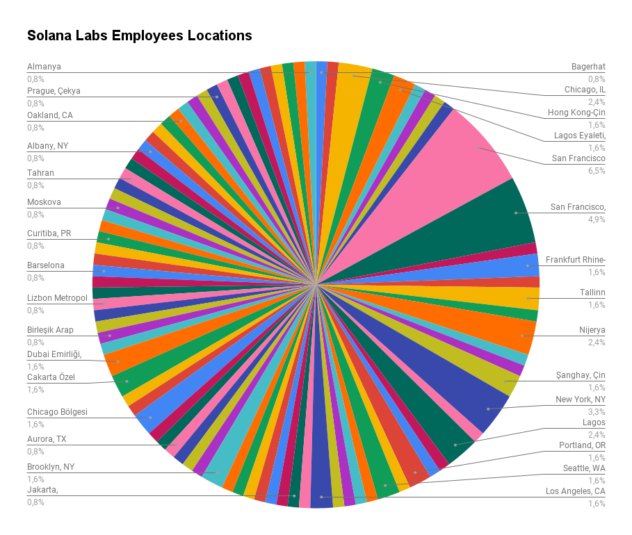
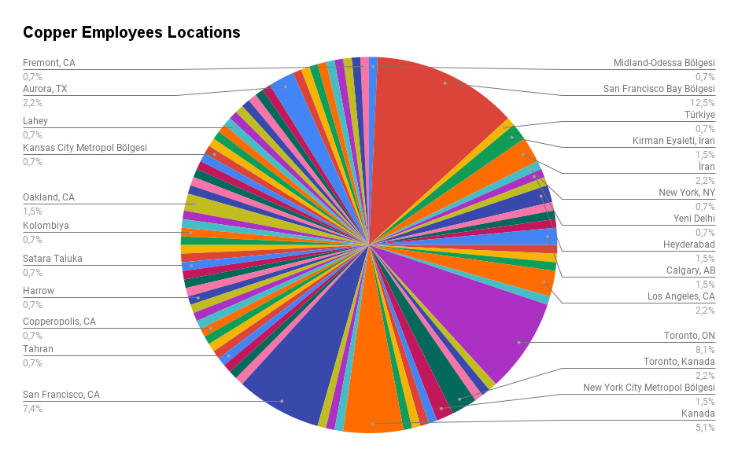

# LinkedIn Profile Scraper
<b>Do you want to find out what is the percentage of remote team members of the company?</b>

**Examples**


This scraper will extract publicly available data:

👨‍💼 <b>Profile:</b> Get the name, title and location of all employees at company

## Features
- <b>Brower automation:</b> headless browser automation using [Puppeteer](https://github.com/puppeteer/puppeteer)
- <b>Data parsing: [Cheerio](https://www.npmjs.com/package/cheerio) </b> parses markup and provides an API for traversing/manipulating the resulting data structure.
- <b>Database:</b> [Airtable](https://airtable.com/) 

- <b>Dependency management: </b>[Npm](https://www.npmjs.com/)

- **Test:** using [Jest](https://www.npmjs.com/package/jest)

- **CORS**: Cross-Origin Resource-Sharing enabled using [cors](https://github.com/expressjs/cors)

## Getting Started
In order to scrape LinkedIn profiles, you need to make sure the scraper is logged-in into LinkedIn. For that you need to find your account's session cookie. I suggest creating a new account on LinkedIn and enable all the privacy options so people don't see you visiting their profiles when using the scraper.
## Installation
Create a new table on Airtable by using companies.csv and employees.csv files in the project root directory. You should get your airtable api_key and base_id, from Airtable API. Then, change AIRTABLE_API_KEY, AIRTABLE_BASE_ID, AIRTABLE_TABLE_COMPANY, AIRTABLE_TABLE_EMPLOYEE fields in .env file with yours.
1. Clone the repo:
   ```
    https://github.com/mfcicek/linkedin-parser
   ```
2. Install the dependencies:
   ```
    npm install
   ```
3. Rename .env.example file as .env.
4. Create a new account on LinkedIn, or use one you already have
5. Open your browser's Dev Tools to find the cookie with the name `li_at`. Use that value for `LINKEDIN_SESSION_COOKIE_VALUE` env file.
## Commands
Running
   ```
   npm start
   ```
Testing
   ```
   npm test
   ```
## Project Structure

```bash
src\
 |--config\           # configuration related things
 |--controller\       # airtable controllers (controller layer)
 |--linkedin_parser\  # data parsing
 |--services\         # Business logic (service layer)
 |--utils\            # Utility classes and functions
 |--app.js            # App entry point
```

## Prevent Duplicate Companies

The program prevents duplication of companies in Airtable.

To make this function work well, please add new company to companies[0]. index of companies array in services/companies.ts file.

Example

```
// One company
const companies: { name: string; url: string }[] = [
 {
   name: 'Copper',
   url: 'https://www.linkedin.com/company/copper-inc/',
 },
]
```
We want to add new company

```
// Two companies
const companies: { name: string; url: string }[] = [
 {
    name: 'Solana Labs',
    url: 'https://www.linkedin.com/company/solanalabs/',
 },
 {
    name: 'Copper',
    url: 'https://www.linkedin.com/company/copper-inc/',
 },
];

````
- Crunchbase parser is not available yet, I need a paid proxy because it blocks me totally. 
- Employee duplications is not available yet, I can't get unique profile url because LinkedIn blocks me. 